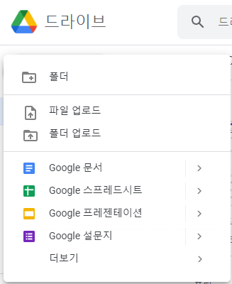
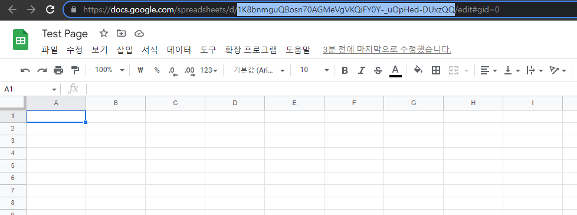
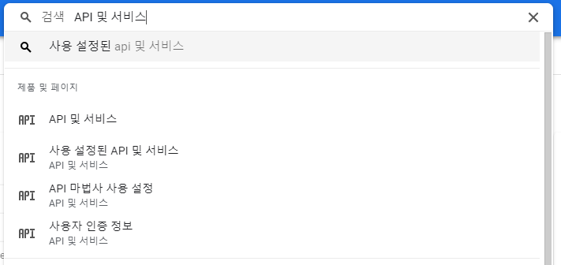
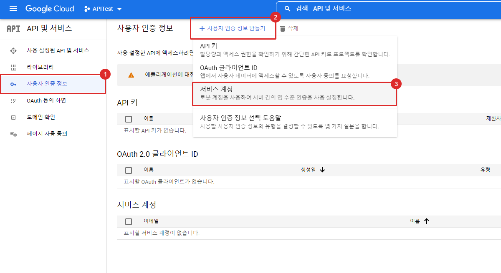
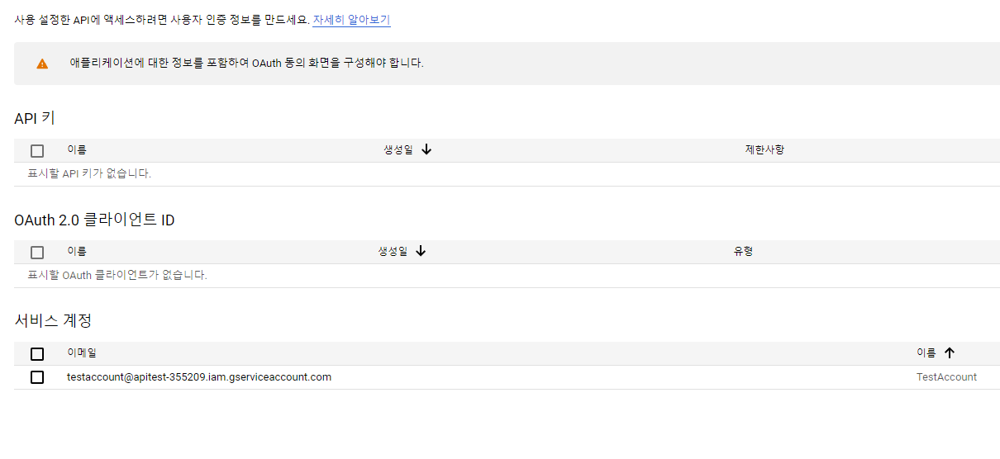
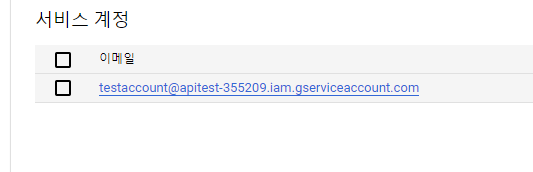
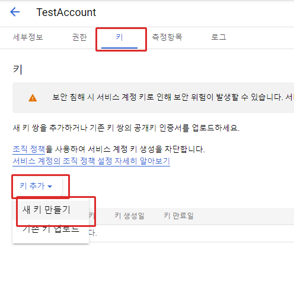
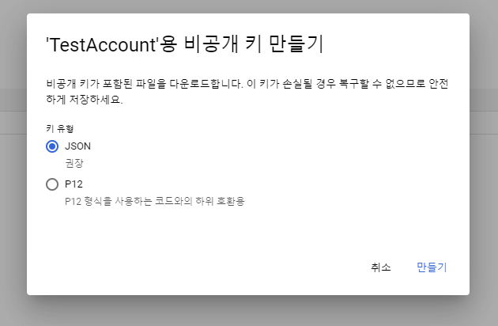
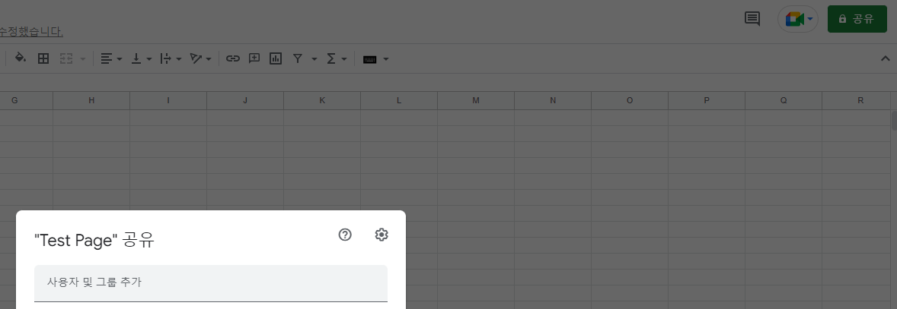

## 필요한 도구

- Visaul Studio Code

- NodeJS

- Google Cloud Platform

- Google Drive

[1. NodeJS 라이브러리](https://lovehp30.tistory.com/entry/%EC%9E%90%EB%B0%94%EC%8A%A4%ED%81%AC%EB%A6%BD%ED%8A%B8%EB%A1%9C-Google-Sheet-API%EC%99%80-%EC%97%B0%EA%B2%B0%ED%95%98%EA%B8%B0#--%--NodeJS%--%EB%-D%BC%EC%-D%B-%EB%B-%-C%EB%-F%AC%EB%A-%AC)

소개

https://www.npmjs.com/package/google-spreadsheet

```bash
npm i google-spreadsheet
```

안에 들여다보시면 Google API Sheet 사용할 수 있도록 기본 코드가 알려줍니다.

```javascript
const { GoogleSpreadsheet } = require("google-spreadsheet");

// Initialize the sheet - doc ID is the long id in the sheets URL
const doc = new GoogleSpreadsheet("<the sheet ID from the url>");

// Initialize Auth - see https://theoephraim.github.io/node-google-spreadsheet/#/getting-started/authentication
await doc.useServiceAccountAuth({
  // env var values are copied from service account credentials generated by google
  // see "Authentication" section in docs for more info
  client_email: process.env.GOOGLE_SERVICE_ACCOUNT_EMAIL,
  private_key: process.env.GOOGLE_PRIVATE_KEY,
});

await doc.loadInfo(); // loads document properties and worksheets
console.log(doc.title);
await doc.updateProperties({ title: "renamed doc" });

const sheet = doc.sheetsByIndex[0]; // or use doc.sheetsById[id] or doc.sheetsByTitle[title]
console.log(sheet.title);
console.log(sheet.rowCount);

// adding / removing sheets
const newSheet = await doc.addSheet({ title: "hot new sheet!" });
await newSheet.delete();
```

이 코드를 구동시키기 위해 필요한 정보는

the sheet ID from the url , GOOGLE_SERVICE_ACCOUNT_EMAIL, GOOGLE_PRIVATE_KEY

3개의 정보가 필요합니다.

## the sheet ID from the url 얻는 방법 (Google Drive)

1. Google Drive 파일 생성 메뉴



3. Google Drive에 스프레드시트 파일 생성



> 주소에 https://docs.google.com/spreadsheets/d /[복사해야할 Sheet ID]/edit#gid=0 입니다.

## GOOGLE_SERVICE_ACCOUNT_EMAIL, GOOGLE_PRIVATE_KEY 얻는 방법 (GCP)

이 데이터를 얻기 위해서는 GCP로 가야합니다.

https://console.cloud.google.com/

[ Google 클라우드 플랫폼로그인 Google 클라우드 플랫폼으로 이동accounts.google.com](https://console.cloud.google.com/)

새 프로젝트를 만들어 주세요

gcp 프로젝트 생성

만들고 API 및 서비스에 들어갑니다.

API 및 서비스를 검색



사용자 인증정보 > 사용자 인증 정보 만들기 > 서비스 계정 클릭합니다.

서비스 계정 만들기

서비스 계정 이름에 원하는 이름을 작성합니다.

그리고 완료를 눌러주세요

API 및 서비스 > 사용자 인증 정보

서비스 계정이 정상적으로 만들어 졌죠?

**GOOGLE_SERVICE_ACCOUNT_EMAIL** 를 얻게 되었네요

하지만 더 진행해야합니다.



저 이메일을 클릭하시고



상 메뉴 에서 키 > 키 추가 > 새 키 만들기를 눌러시고 키 유형을 JSON으로 받아주세요

비공개 키 만들기

키를 다운 받으실텐데

그 파일안에는 **GOOGLE_SERVICE_ACCOUNT_EMAIL**,**GOOGLE_PRIVATE_KEY** 가 들어 있습니다.

**필수**: 스프레드 시트의 **GOOGLE_SERVICE_ACCOUNT_EMAIL**을 이용해 편집할려면

공유 계정을 추가해주셔야 합니다.



받은 JSON을 내 credientials.JSON으로 명칭을 변경하고

```javascript
const { GoogleSpreadsheet } = require("google-spreadsheet");

const doc = new GoogleSpreadsheet("스트레드 시트 ID ");

const credentials = require("./credentials.json");

async function Run() {
  await doc.useServiceAccountAuth(credentials);
  await doc.loadInfo();
  await doc.updateProperties({ title: "APITest" }); //스트레드 시트 제목 변경
  console.log(doc.title);
  const sheet1 = doc.sheetsByIndex[0]; // WorkSheet 선택
  const result = await sheet1.getRows();
  console.log(result);
}

Run();
```

Excel의 정보가 변경되는걸 확인할 수 있습니다.
