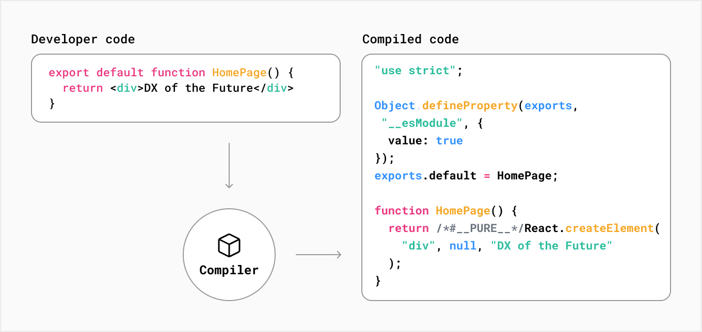

# NextJS를 시작하기전 알아야하는 것들

- 어떤 환경에서 코드가 동작하는지: 개발 vs 프로덕션
- 코드가 언제 동작하는지: Build Time vs Runtime
- 어디서 렌더링 되는지 : Client vs Server

:::note
https://nextjs.org/learn/foundations/how-nextjs-works  
에서 직접 학습하시는 것을 권장합니다.
:::

### Development and Production Environments

- 개발환경: TypeScript, ESLint, Fast Refresh 등으로 개발 환경개선
- 프로덕션환경: 코드의 수행능력을 높이기 위해 초점맞춘 셋팅

### The Next.js Compiler

Rust, SWC, minification, bundling으로 구성되어있어 초초초빠르게 해석함

### What is Compiling?

### What is Minifying?

### What is Bundling?

### What is Code Splitting?

`pages/`폴더를 기준으로 코드가 분할 되는듯 하다.

### Build Time and Runtime

- Build Time: 서버에 배포되기 전의 상태
- RunTime: 배포된 후 사용자의 요청에 대한 응답하고 실행되는 기간

### Client and Server

### What is Rendering?

React :arrow_right:HTML의 UI  = 렌더링

- Client-Side Rendering
- 
- Pre-Rendering(SSR, SSG)
- 

### What is the Network?

> Origin Servers

- ContentDeliveryNetwork
- The Edge
