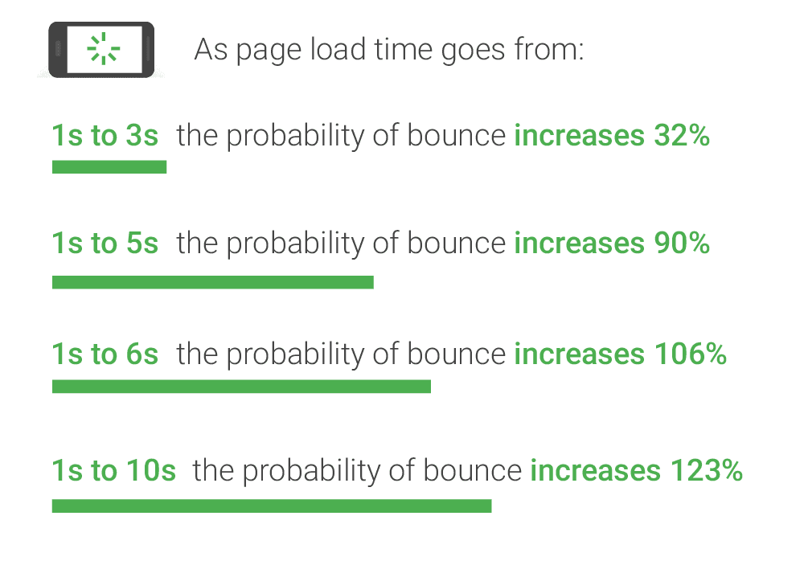
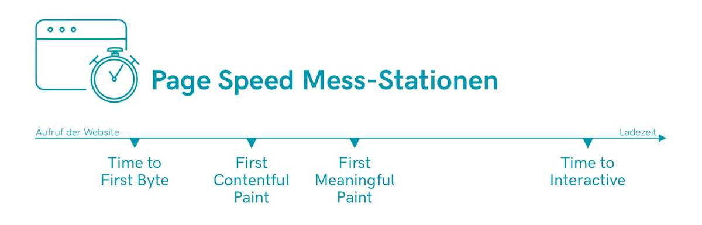
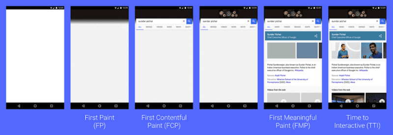

# 웹 최적화

사용자가 페이지를 방문한 후, 아무런 요청을 하지 않고 떠나는 비율을 **이탈률** 이라고 한다.

## 페이지 속도 측정에 가장 중요한 4가지의 값

## TTFB(Time to First Byte)

사용자가 웹 사이트를 호출하면 웹 서버에 수신한 첫 번째 도착하는 바이트!
즉, HTTP요청에 걸리는 시간 + 서버의 요청 처리 시간 + 서버에서 클라이언트까지의 응답 시간이라고 보면 된다.

TTFB 속도는 서버의 프로세스와 연관되어 있다.

## FP(First Paint)

흰 화면에서 화면에 무언가가 처음으로 그려지기 시작하는 순간이다.

## FCP(First Contentful Panint)

텍스트나 이미지가 출력되기 시작하는 순간이다.
Pagespeed Insights( 페이지 속도를 측정 해주는 구글 툴)로 TTFB측정은 건너뛰고 FCP측정을 첫 번째로 한다. 이는 개발자를 위한 것이며, Pagespeed Insight는 FCP를 활용하여 OnPage 최적화를 위한 제안을 해준다.

### **최적화 방법**

1. 데이터 압축
2. HTTP/2 사용
3. 리로드 할 필요 없는 콘텐츠를 캐싱
4. 코드 경량화와 코드 스플릿팅(splitting)
5. 라이브러리 정리

## FMP(First Meaningful Paint)

사용자에게 의미 있는 콘텐츠가 그려지기 시작하는 첫 순간이다. 콘텐츠를 노출하는데 필요한 CSS, 자바스크립트 로드가 시작되고 스타일이 적용되어 주요 콘텐츠를 읽을 수 있다.

사용자는 이 시점에서 페이지가 완전히 로드가 되었다고 인식한다. 그러므로 FMP의 최적화는 좀 더 중요하다.

### **최적화 방법**

1. 이미지 최적화
2. 사진이 많은 웹 페이지일 때는 LazyLoading (예: Twitter, Instagram 등 스크롤을 내리면 추가 페이지 로딩)

## TTI(Time To Interactive)

자바스크립트의 초기 실행이 완료되어서 사용자가 직접 행동을 취할 수 있는 순간이다.

**최적화 방법**

FCP와 FMP를 최적화!

위에 자료를 통해 페이지 로딩에 대해 전체적으로 보여준다. 

` 화면 진입 시에 FCP 조차 느려서 사용자 이탈률이 증가할 것 같아요. ` 라는 말을 이해했다.

## 출처

Roland Guelle, 「 How to Measure Page Speed 」, https://en.ryte.com/magazine/measure-page-speed

TOAST UI, 「 성능 최적화 」, https://ui.toast.com/fe-guide/ko_PERFORMANCE/

Philip Walton, 「 User-centric performance metrics 」, https://web.dev/user-centric-performance-metrics/

Bikash Rai, 「First Contentful Paint (FCP) and First Meaningful Paint (FMP) Explained」, https://www.acmethemes.com/blog/first-contentful-paint-and-first-meaningful-paint/

[SooJae's Devlog](https://front-end.me/) https://front-end.me/web/web-site-optimization/